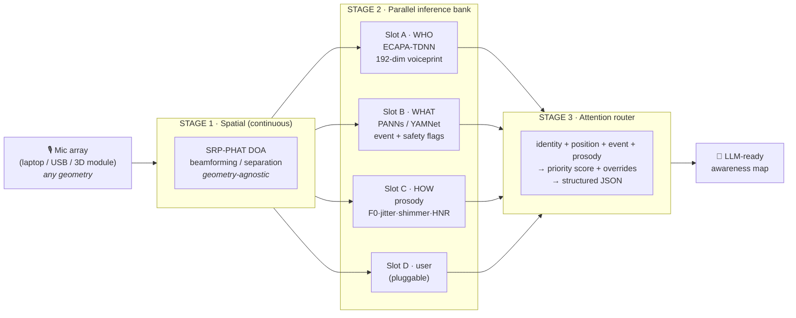

<div align="center">

# 🦇 Daredevil

### Local, private acoustic context for LLMs — **WHO** is speaking, **WHERE** they are, **WHAT** is happening, and **HOW** they sound.

*Converting raw environmental audio into structured, real-time context before it reaches the model.*
**OAK-D for ears.**

[](LICENSE)
[](https://www.python.org/)
[-brightgreen.svg)](#runs-everywhere)
[](#privacy-is-the-point)
[](#roadmap)

</div>

---

> **"To be scalable, it has to run where the AI agents are."**

The robot proved the idea. The laptop distributes it. Daredevil is the open-source SDK that turns any microphone — a laptop's built-in array, a USB mic, or a 3D sensor module — into a stream of **structured acoustic awareness** that a language model can actually reason about.

Today, an LLM listening to a room gets, at best, a raw transcript. It doesn't know *who* said it, *where* they were, whether a *smoke alarm* is going off behind them, or whether they sound *calm* or *terrified*. Daredevil computes all of that **locally, in parallel, with no cloud**, and hands the model a clean JSON awareness map.

**The structured awareness map *is* the product.** Everything else is plumbing.

---

## 60-second demo

```bash
git clone https://github.com/alanchelmickjr/daredevil
cd daredevil
pip install -e .          # core is pure-Python — zero heavy deps required
python -m daredevil.demo  # runs end-to-end, anywhere
```

No microphone? No GPU? No models downloaded? **It still runs** — a deterministic synthetic scene exercises the full pipeline. Here's the actual output:

```text
▶ enrolling 'alan' (3s) ...
  enrolled: alan  enrollment_confidence=0.632  (192-dim voiceprint)

── AWARENESS MAP (this is what the LLM receives) ──────────────
{
  "routed_to_llm": ["UNKNOWN-001", "alan"],
  "sources": [
    {
      "id": "UNKNOWN-001",
      "type": "unknown",
      "attention": "surface",
      "event": { "class": "baby_cry", "confidence": 0.95, "safety_critical": true },
      "prosody": { "state": "distressed", "distress": 0.95 },
      "position": { "azimuth": 45.0, "elevation": 10.0 },
      "priority": 1.00,
      "priority_override": "SAFETY_CRITICAL"
    },
    {
      "id": "alan",
      "type": "enrolled",
      "attention": "surface",
      "event": { "class": "speech", "confidence": 0.95 },
      "prosody": { "state": "calm", "distress": 0.12 },
      "identity": { "confidence": 0.632, "match_score": 1.00, "enrollment_confidence": 0.632 },
      "position": { "azimuth": 0.0, "elevation": 0.0 },
      "priority": 0.40
    },
    {
      "id": "UNKNOWN-002",
      "type": "unknown",
      "attention": "ambient",
      "event": { "class": "music", "confidence": 0.95 },
      "prosody": { "state": "calm", "distress": 0.05 },
      "position": { "azimuth": 270.0, "elevation": 0.0 },
      "priority": 0.16
    }
  ],
  "timing": { "parallel_ms": 76.1, "sequential_ms": 85.4 },
  "privacy": { "cloud_used": false, "raw_audio_stored": false, "embeddings": "non-reversible" }
}

════════════════════════════════════════════════════════════
  ACOUSTIC AWARENESS MAP   — what the LLM receives
  array: macbook-3 (3 mics, spatial)   backend: fallback
  sources (high → low priority):
  ⚠ [1.00] ██████████ →LLM UNKNOWN-001  baby_cry  az   45° NE     distressed
           └─ OVERRIDE: SAFETY_CRITICAL
    [0.40] ████······ →LLM alan         speech    az    0° N      calm       id=0.63
    [0.16] ██········ ···· UNKNOWN-002  music     az  270° W      calm
  attention gate → LLM: UNKNOWN-001, alan   (others heard, gated out)
  ──────────────────────────────────────────────────────────
  timing: parallel 76ms  vs  sequential 85ms
  privacy: on-device · no cloud · embeddings non-reversible
════════════════════════════════════════════════════════════
```

The enrolled human is identified. The baby cry jumps the queue. The radio is heard and tracked — but **the attention gate keeps it out of the LLM**. The model gets a ranked, *filtered* map, not a firehose.

---

## Use it in three lines

```python
from daredevil import Pipeline

pipeline = Pipeline()                      # auto-detects the mic array
pipeline.enroll("alan", mic_seconds=3)     # 3s is enough to know a voice
context = pipeline.listen(duration=1.0)    # -> structured awareness map (dict)

response = llm.generate(audio_context=context, user_input=transcript)
```

That's the whole pitch: **the LLM receives structured context instead of raw audio.**

---

## WHO comes first

Identity is the headline. An agent that knows *"this is Alan asking"* — versus an unknown voice, versus a child — behaves completely differently, and it can do so **without surveilling anyone**:

- A voiceprint is a **non-reversible 192-dimensional vector**. You cannot reconstruct speech from it.
- **Raw audio is never stored and never transmitted.** Ever.
- Voiceprints are encrypted at rest and sync **peer-to-peer** across your own devices — no cloud account, no server.
- Enrollment takes **3 seconds** and gets more confident the longer it hears you: `C(t) = 1 − e^(−t/3)` → 3s ≈ 0.63, 10s ≈ 0.96, 20s ≈ 0.999.

That's how an LLM gets *"Alan is speaking"* inserted perfectly into its context — privately.

---

## Architecture

Three stages. The middle stage runs every model **in parallel**, so latency is the *slowest* slot, not the *sum* of all slots.



| Stage | Job | Default backend |
|---|---|---|
| **1 — Spatial** | DOA + separation from a coordinate map; adapts to any array | `pyroomacoustics` (SRP-PHAT) |
| **2A — WHO** | speaker embedding + identity match | SpeechBrain ECAPA-TDNN (Apache-2.0) |
| **2B — WHAT** | 527-class acoustic events + safety flags | PANNs CNN14 / YAMNet |
| **2C — HOW** | prosody → calm / stressed / confused / distressed | librosa (permissive); OpenSMILE optional |
| **2D — user** | your own `int8`/ONNX/torch model | the `Slot` interface |
| **3 — Router** | fuse → priority → overrides → JSON | pure Python |

See [`docs/ARCHITECTURE.md`](docs/ARCHITECTURE.md) and [`docs/MODELS.md`](docs/MODELS.md) for the full design and model/license rationale.

---

## Runs everywhere

The core has **zero required dependencies** — it produces a full awareness map on the Python standard library alone. Heavier backends are opt-in extras that *accelerate* the exact same pipeline.

| Environment | WHO | WHERE | WHAT | HOW | Notes |
|---|:--:|:--:|:--:|:--:|---|
| **Any machine** (no extras) | ✅\* | ✅\* | ✅\* | ✅\* | pure-Python fallback — proves the architecture |
| **Laptop CPU** (`[full]`) | ✅ | ✅ | ✅ | ✅ | real models, no GPU needed |
| **MacBook** | ✅ | ✅ | ✅ | ✅ | CoreML / Apple Neural Engine acceleration |
| **Jetson / Orin** | ✅ | ✅ | ✅ | ✅ | CUDA / TensorRT |
| **Single mic** | ✅ | — | ✅ | ✅ | no direction, everything else works |

<sub>\* Fallback backends are heuristic stand-ins so the pipeline always runs; install the extras for real model accuracy.</sub>

```bash
pip install -e ".[full]"     # everything
pip install -e ".[speaker]"  # just WHO (ECAPA)
pip install -e ".[events]"   # just WHAT (PANNs)
pip install -e ".[prosody]"  # just HOW (librosa)
pip install -e ".[spatial]"  # WHERE (pyroomacoustics)
pip install -e ".[audio]"    # live mic capture (sounddevice)
pip install -e ".[viz]"      # matplotlib radar
```

---

## Privacy is the point — and the law requires it

Daredevil is **local-first and cloud-never** by design — `allow_cloud=False` is a hard default with no code path that sends audio or embeddings anywhere.

**This isn't just good engineering — it's legally necessary.** Under COPPA and the California Age-Appropriate Design Code Act, transmitting, decoding, or identifying a child's voiceprint in the cloud is **illegal**. You cannot legally send a baby's cry or a child's voice to a cloud API for identification. Daredevil is the only architecture that can classify "baby_cry" as SAFETY_CRITICAL, identify that your kid is on your computer, or detect a child in distress — **without breaking federal law** — because the audio and embeddings never leave the device. Period.

- **On-device inference.** No API keys. No network egress. (The previous cloud prosody API was removed in favor of fully-local analysis.)
- **Non-reversible embeddings.** Identity is math, not recordings.
- **Encrypted at rest.** Voiceprints are encrypted with a key only you hold.
- **Fleet identity over [Gun](https://gun.eco/).** Enroll once; your trusted devices recognize you — synced peer-to-peer, encrypted with SEA, no server required. See [`docs/PRIVACY.md`](docs/PRIVACY.md) and [`fleet/`](daredevil/fleet/).

---

## Software is open. Hardware is the product.

Same model as OAK-D / DepthAI: **this SDK is MIT-licensed and fully open.** It runs great on commodity mics so anyone can build with it.

The premium tier is a small sensor module that adds what a laptop physically cannot: a **3D microphone array** (full elevation, not just a plane), an **ultrasonic range** beyond human hearing, and **on-device inference** so the host doesn't even need a GPU. That hardware and its firmware architecture are **patent-pending** (US provisional).

> *Everything in this repo runs on your laptop's built-in mics — no cloud, no GPU. The module adds 3D + ultrasonic and runs the inference on-device. Software proves the architecture; hardware proves it scales.*

---

## Roadmap

- [x] Package scaffold, pure-Python core, one-command demo
- [x] WHO: enrollment + identity match + confidence curve
- [x] Stage 3 router: priority scoring, safety + distress overrides, UNKNOWN-NNN tracking
- [x] Structured JSON awareness map + terminal radar
- [x] Local-first identity store + Gun fleet scaffold
- [x] Real model backends wired (ECAPA + librosa verified on MacBook MPS)
- [x] MCP server — local tool for Claude Code / Claude Desktop / agents
- [ ] PANNs CNN14 event classification (reference backend for WHAT)
- [ ] Live multi-mic SRP-PHAT validated on hardware
- [ ] ONNX Runtime portable backend (CoreML / TensorRT) + int8
- [ ] Live Gun P2P voiceprint sync
- [ ] `pip install daredevil` on PyPI

Full plan: [`docs/ROADMAP.md`](docs/ROADMAP.md).

---

## MCP server — give your AI agent ears

Daredevil ships as an [MCP](https://modelcontextprotocol.io/) server. Any MCP-capable client (Claude Code, Claude Desktop, custom agents) can call it as a local tool — the agent gets structured acoustic awareness without audio ever leaving your machine.

```bash
pip install -e ".[mcp]"
daredevil mcp                # stdio transport — Claude Code / Claude Desktop
```

**Tools exposed:**
| Tool | What it returns |
|---|---|
| `listen` | Full awareness map (all sources, all slots) |
| `awareness` | Only the sources that pass the attention gate — what the LLM should act on |
| `enroll_speaker` | Enroll a new voice (name + seconds) |
| `devices` | Installed backends, array, enrolled speakers |

Configure in Claude Code (`.claude/settings.local.json`):
```json
{
  "mcpServers": {
    "daredevil": {
      "command": "python",
      "args": ["-m", "daredevil.mcp_server"]
    }
  }
}
```

Now Claude can *hear the room* — locally, legally, privately.

---

## Projected features

Identity unlocks things that aren't possible any other way — all on-device:

- **Parental presence detection** — Know whether a child or an adult is using the device. Your kids can't use *your* Claude by typing a password; their voice isn't yours.
- **Household safety net** — Detect a baby cry, a fall, a smoke alarm — and know *who* is (or isn't) nearby to respond.
- **Speaker-aware conversation** — An agent that knows "Alan asked this, then his daughter asked that" can maintain separate contexts, enforce age-appropriate boundaries, and recall per-person preferences.
- **Attention steering** — The wake word + voiceprint together let the agent know not just *that* someone spoke, but *who* and *whether it was directed at the agent*.
- **Device handoff** — Enroll once, sync voiceprints P2P across your devices. Walk from your desk to the kitchen and the agent already knows it's you.

All of this requires local voiceprint identification of minors — which is **illegal to do in the cloud** under COPPA and California law. Daredevil is the only legal path.

---

## Commands

```bash
python -m daredevil.demo               # full demo (synthetic scene)
python -m daredevil.demo --live        # use your real microphone
python -m daredevil serve              # web HUD at http://127.0.0.1:8770
daredevil mcp                          # MCP server for Claude / LLM agents
daredevil bench                        # crowd-scaling latency (→ LLM stays flat)
daredevil enroll --name alan --seconds 10     # enroll a speaker
daredevil listen --json                # one awareness map -> stdout
daredevil devices                      # what was detected / installed
```

---

## License & credits

Software: **MIT** © 2026 Alan Helmick Jr. — see [`LICENSE`](LICENSE).
Hardware module + firmware architecture: **patent-pending** (Mira AI LLC).

Built to give every AI agent ears it can trust.
